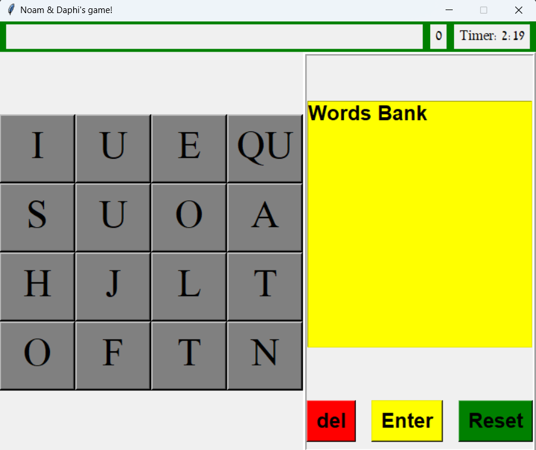

  
  <h1 align="center" style="border-bottom: none"><b>Introduction to Computer Science - Exercise 12 - Boggle with custom GUI</b></h1>

  

    <b>Boggle</b> is the 12th and final exercise I've completed in Huji's <b>Introduction to Computer Science</b> course.
     
    Boggle is a board game where you need to find words in the English Dictionary.
     
    The main objective of this exercise is to become familiar with <b>GUIs</b> and <b>OOP</b>.
  

 

  <h2 align="left" style="border-bottom: 1px solid gray">Code Structure</h2>

  <ul align="left">
    <li>OOP utilization, including multi-level inheritance and code abstraction</li>
    <li>Separation of logic and design</li>
    <li>No magic numbers - use of constant variables and a consistent design pattern</li>
    <li>Fast and efficient utilities</li>
    <li>Implementations of both generators and iterators</li>
    <li>Recursive functions</li>
    <li>Functions that return inner functions</li>
    <li>Comprehensive API with robust error handling</li>
    <li>Dynamic brute-force mechanisms for different functions</li>
  </ul>

 

  <h2 align="left" style="border-bottom: 1px solid gray">Features</h2>

  <ul align="left">
    <li>Custom sounds when playing the game (for Windows users)</li>
    <li>Random cursor for each button</li>
    <li>Option to clear your current selection instantly</li>
    <li>Option to clear up to a specific point by pressing the desired button</li>
    <li>Dynamic action button</li>
    <li>Dynamic word bank</li>
  </ul>

 

  <h2 align="left" style="border-bottom: 1px solid gray">Usage</h2>

  
To run the project on your personal machine:

  <ol align="left">
    <li>Clone this repository using <code>git clone &lt;url&gt;</code></li>
    <li>Open the cloned project in your IDE</li>
    <li><i>(Optional)</i> Create a virtual environment using <code>python3 -m venv venv</code></li>
    <li>Use <code>pip install -r requirements.txt</code> to install all required libraries</li>
    <li>Run <code>python3 &lt;python file&gt;</code> to start the project</li>
  </ol>

 

  <h2 align="left" style="border-bottom: 1px solid gray">Media</h2>

  

    
     
    
  

 

  <h2 align="left" style="border-bottom: 1px solid gray">Contributing</h2>

  

    Pull requests are welcome. For major changes, please open an issue first to discuss what you would like to change.
  

